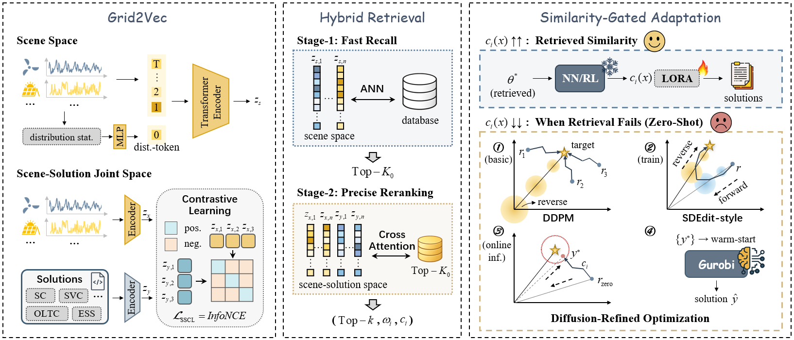
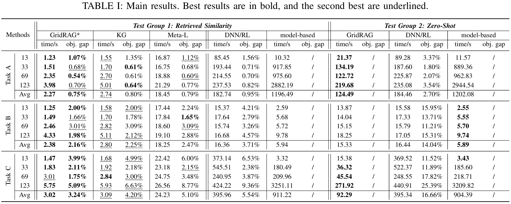

# GridRAG

## 🔧 Basic Information
We propose **GridRAG**, the first retrieval-augmented framework for distribution network optimization. By integrating multi-modal representation learning, retrieval, and adaptive refinement, GridRAG enables fast and accurate solution generation across diverse and OOD scenarios.

## 📐 The Overall Framework


Its architecture is built upon three key innovations: 
1) **Grid2Vec** embeds scenarios and solutions into a joint representation space, 
capturing fine-grained semantic correlations. 
2) **Hybrid Retrieval** identifies feasible solution-oriented retrieval, 
progressing from *Fast Recall* to *Precise Reranking* based on the learned
joint embeddings. 
3) **Similarity-Gated Adaptation** controls refinement intensity according to
retrieval similarity. For zero-shot cases, an SDEdit-style diffusion
procedure treats the retrieved solution as an initial state and applies
adaptive diffusion with iterative refinement, forming an optimal attraction
path toward a warm-start feasible region.

## 📁 Project Structure

```
GridRAG/
│───README.md                             # Project documentation
│───requirements.txt                      # Python dependencies
│───main_online.py                        # Main pipeline
│───main_vvc.py                           # Entry point for Task A (VVC)
│───main_ed.py                            # Entry point for Task B (ED)
│───main_joint.py                         # Entry point for Task C (Joint Optimization)
│───train_dnn_ed.py                       # Entry point for DNN baseline (Task B)
│───train_rl_joint.py                     # Entry point for RL baseline (Task C)
│───train_rl_vvc.py                       # Entry point for RL baseline (Task A)
│───config.py                             # Training and evaluation configuration
│───config_networks.py                    # Configuration for different network topologies
│───data/                                 # Dataset directory
│   │───network/                          # Topologies for all networks
│   │   │───ieee13.py                     # Meta data for IEEE-13 bus system
│   │   └───...
│   │───profiles/                         # Profiles for all scenarios
│   │   │───ev_profiles_001_13.csv        # EV profiles
│   │   │───scenarios_001_13.csv          # WT and PV profiles
│   │   └───...
│   │───online_inf/                       # Online inference input data
│   │   │───ev_profiles_online_33.csv
│   │   └───scenario_online_33.csv
│   │───data_loader.py                    # Dataloader for database
│   └───...
│───solvers/                              # Solver module
│   │───optimizer.py                      # Solver interface
│───Model/                                # Main model architecture
│   │───retrieval/                        # Retrieval module
│   │   │───feature_extractor.py           
│   │   │───distance_metrics.py           
│   │   └───retriever.py                  
│   │───diffusion/                        # Diffusion-refinement module
│   │   │───diffusion_model.py
│   │   └───...
│───models/                               # Downstream optimization models
│   │───day_ahead/                        # Stage 1 mixed-integer problem for Task A
│   │───ed/                               # Task B models
│   │───joint/                            # Task C models
│   │───power_flow/                       # Power flow models
│   │───real_time/                        # Stage 2 continuous optimization for Task A
│   │───dnn/                              # DNN baseline models
│   │───rl/                               # RL baseline models
│   └───base_model.py                     # Universal interface for optimization models
│───scripts/                              # Scripts for building database features
│   │───database_feature/                 # Stores features of all scenario sets for each topology
│   └───build_database_features.py        # Script to extract features for all scenario sets
│───utils/                                # Utility functions
│───opt_results/                          # Optimization results
└───...
```

## 🚀 Quick Start
### 1. Database Construction
We provide a complete pipeline for database construction. 
To build your own database, simply run the three optimization tasks using
`main_vvc.py`, `main_ed.py`, `main_joint.py`.
We offer flexible parameter configurations: use the `--network` parameter to select
the network topology and the `--scenario-id` parameter to specify the scenario.

Download the following datasets from https://www.jianguoyun.com/p/DZKo0NQQgv7ODRjT9p8GIAA and place them in the `data/` directory:
- `profiles`
- `online_inf`

> **Note**:  
> - You can customize your own input scenario by changing `online_inf`, as long as the format remains consistent.
> - This is only a demo for running the pipeline, not the complete experimental data in this study. 

The results will be saved in the `opt_results/` directory as `.json` files.

### 2. DNN/RL Baselines
We have implemented two types of baselines: a DNN-based baseline for Task B, 
and RL-based baselines for Tasks A & C. To test these baselines, run 
`train_dnn_ed.py`, `train_rl_vvc.py` and `train_rl_ed.py`. 

Evaluating the cross-scenario generalization capability of the models is straightforward.
You can set the `mode` parameter to `cross-test` to enable cross-scenario testing.
Then, you can specify the `train-scenario` and `test-scenario` and the results will be stored in the `opt_results/`.

### 3. Run Main Pipeline —— GridRAG
TThe complete GridRAG pipeline is integrated into `main_online.py` which includes
online data loading, multi-modal embedding, database retrieval,
diffusion-based refinement, and solver warm-starting.

For convenient ablation studies, you can set the `diffusion_mode` parameter to `off` 
to disable the diffusion refinement step (the default is `auto` which
dynamically adjusts the diffusion intensity based on retrieval confidence).

> **Note**:  
> - Make sure you have run `scripts/build_database_features.py` beforehand;
otherwise, the retrieval module will fail to execute.
> - This repository contains code for review purposes. The complete implementation will be released upon paper acceptance. 

## 📊 Experiment Results

We evaluate GridRAG on a comprehensive, large-scale benchmark encompassing diverse tasks
and varying distribution network topologies. To the best of our knowledge, this
represents **the most extensive evaluation benchmark** in the field of learning-based
power system optimization to date. Results establish that GridRAG consistently
outperforms strong baselines in both **solution accuracy** and **time efficiency**.

